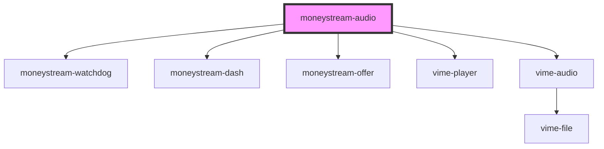

# moneystream-audio

<!-- Auto Generated Below -->

## Properties

| Property               | Attribute              | Description | Type     | Default       |
| ---------------------- | ---------------------- | ----------- | -------- | ------------- |
| `duration`             | `duration`             |             | `string` | `undefined`   |
| `mediaType`            | `media-type`           |             | `string` | `'audio/mp3'` |
| `mediatitle`           | `mediatitle`           |             | `string` | `''`          |
| `monetizationstrategy` | `monetizationstrategy` |             | `string` | `'required'`  |
| `moneystreamdisplay`   | `moneystreamdisplay`   |             | `string` | `'show'`      |
| `payto`                | `payto`                |             | `string` | `undefined`   |
| `price`                | `price`                |             | `number` | `undefined`   |
| `src`                  | `src`                  |             | `string` | `undefined`   |

## Dependencies

### Depends on

- [moneystream-watchdog](../moneystream-watchdog)
- [moneystream-dash](../moneystream-dash)
- [moneystream-offer](../moneystream-offer)
- vime-player
- vime-audio

### Graph

----------------------------------------------

*Built with [StencilJS](https://stenciljs.com/)*
