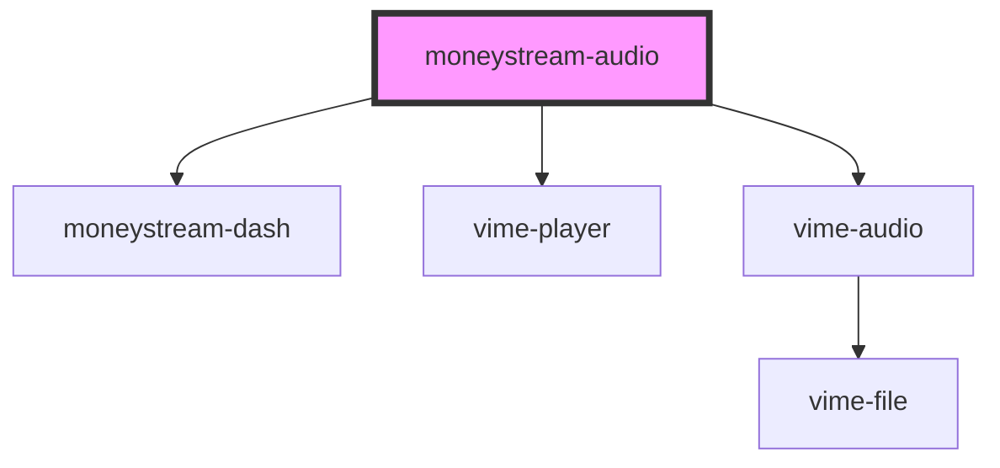

# moneystream-audio

<!-- Auto Generated Below -->

## Properties

| Property               | Attribute              | Description | Type     | Default       |
| ---------------------- | ---------------------- | ----------- | -------- | ------------- |
| `mediaTitle`           | `media-title`          |             | `string` | `''`          |
| `mediaType`            | `media-type`           |             | `string` | `'audio/mp3'` |
| `monetizationstrategy` | `monetizationstrategy` |             | `string` | `'required'`  |
| `moneystreamdisplay`   | `moneystreamdisplay`   |             | `string` | `'show'`      |
| `payto`                | `payto`                |             | `string` | `undefined`   |
| `src`                  | `src`                  |             | `string` | `undefined`   |

## Dependencies

### Depends on

- [moneystream-dash](../moneystream-dash)
- vime-player
- vime-audio

### Graph

----------------------------------------------

*Built with [StencilJS](https://stenciljs.com/)*
