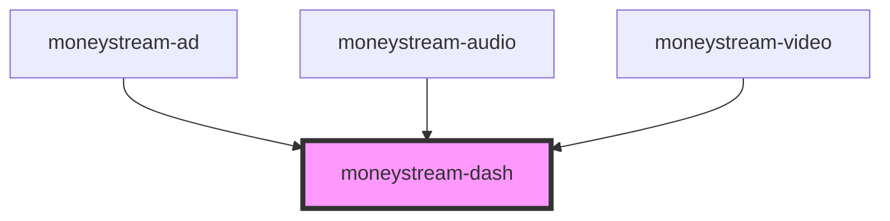

# moneystream-dash

<!-- Auto Generated Below -->

## Properties

| Property       | Attribute       | Description | Type      | Default                       |
| -------------- | --------------- | ----------- | --------- | ----------------------------- |
| `debug`        | `debug`         |             | `boolean` | `false`                       |
| `payto`        | `payto`         |             | `string`  | `'fullcycle@moneybutton.com'` |
| `showControls` | `show-controls` |             | `boolean` | `false`                       |

## Events

| Event                  | Description | Type                  |
| ---------------------- | ----------- | --------------------- |
| `monetizationProgress` |             | `CustomEvent<any>`    |
| `monetizationStarted`  |             | `CustomEvent<string>` |
| `monetizationStopped`  |             | `CustomEvent<string>` |

## Methods

### `getStatus() => Promise<{ hasExtension: boolean; extension: any; monetizationstatus: string; monetizationamount: number; }>`

#### Returns

Type: `Promise<{ hasExtension: boolean; extension: any; monetizationstatus: string; monetizationamount: number; }>`

### `start() => Promise<void>`

#### Returns

Type: `Promise<void>`

### `stop() => Promise<void>`

#### Returns

Type: `Promise<void>`

## Dependencies

### Used by

 - [moneystream-ad](../moneystream-ad)
 - [moneystream-audio](../moneystream-audio)
 - [moneystream-video](../moneystream-video)

### Graph

----------------------------------------------

*Built with [StencilJS](https://stenciljs.com/)*
