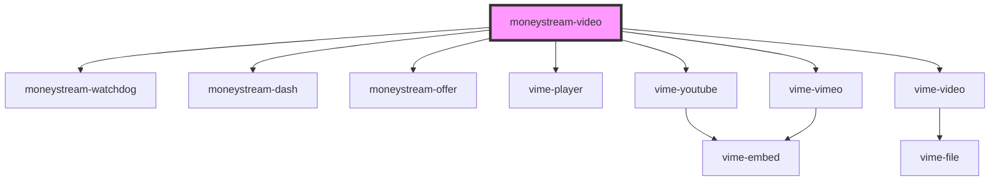

# my-component

<!-- Auto Generated Below -->

## Properties

| Property               | Attribute              | Description | Type     | Default                       |
| ---------------------- | ---------------------- | ----------- | -------- | ----------------------------- |
| `duration`             | `duration`             |             | `string` | `undefined`                   |
| `mediatitle`           | `mediatitle`           |             | `string` | `''`                          |
| `monetizationstrategy` | `monetizationstrategy` |             | `string` | `'required'`                  |
| `moneystreamdisplay`   | `moneystreamdisplay`   |             | `string` | `'show'`                      |
| `payto`                | `payto`                |             | `string` | `'fullcycle@moneybutton.com'` |
| `price`                | `price`                |             | `number` | `undefined`                   |
| `provider`             | `provider`             |             | `string` | `'youtube'`                   |
| `type`                 | `type`                 |             | `string` | `"video/mp4"`                 |
| `vid`                  | `vid`                  |             | `string` | `undefined`                   |

## Dependencies

### Depends on

- [moneystream-watchdog](../moneystream-watchdog)
- [moneystream-dash](../moneystream-dash)
- [moneystream-offer](../moneystream-offer)
- vime-player
- vime-youtube
- vime-vimeo
- vime-video

### Graph

----------------------------------------------

*Built with [StencilJS](https://stenciljs.com/)*
