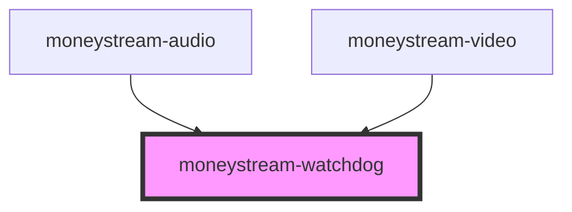

# moneystream-watchdog

<!-- Auto Generated Below -->

## Properties

| Property   | Attribute  | Description | Type     | Default |
| ---------- | ---------- | ----------- | -------- | ------- |
| `interval` | `interval` |             | `number` | `9`     |

## Events

| Event                  | Description | Type                  |
| ---------------------- | ----------- | --------------------- |
| `monetizationWatchdog` |             | `CustomEvent<string>` |

## Methods

### `start() => Promise<void>`

#### Returns

Type: `Promise<void>`

### `stop() => Promise<void>`

#### Returns

Type: `Promise<void>`

## Dependencies

### Used by

 - [moneystream-audio](../moneystream-audio)
 - [moneystream-video](../moneystream-video)

### Graph

----------------------------------------------

*Built with [StencilJS](https://stenciljs.com/)*
